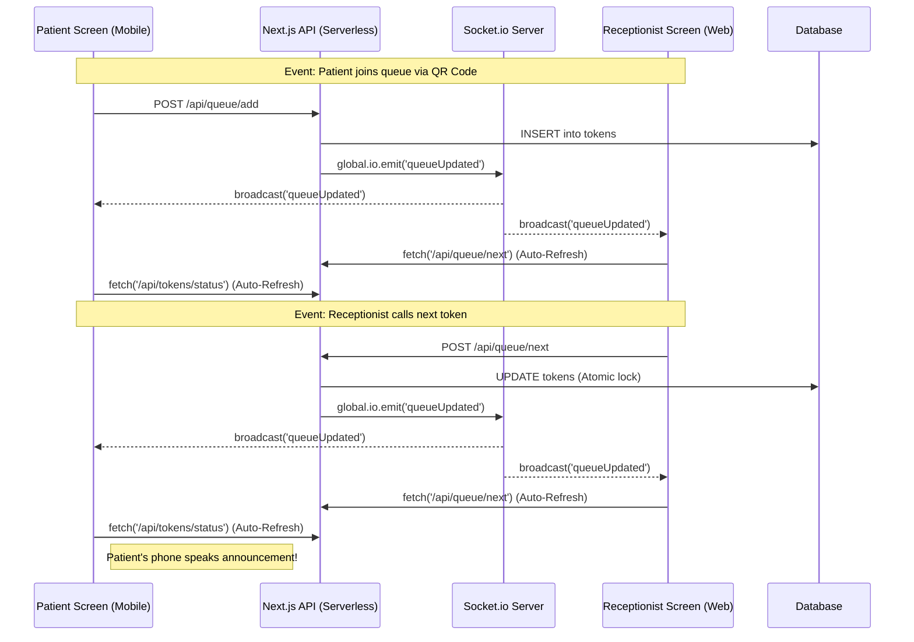

# Queue Cure '26 - Live Sync Architecture

This document maps out the WebSocket events used in the application to ensure that both the Receptionist and Patient screens stay in perfect synchronization without any manual polling.

## Socket Event Diagram

## Description of Events
- **`queueUpdated`**: The single source of truth broadcast event. When emitted by the backend, any connected client will re-fetch their respective state. This prevents data payload bloat over web sockets, using the socket strictly as a low-latency trigger, while relying on secure REST APIs to deliver the actual state.
